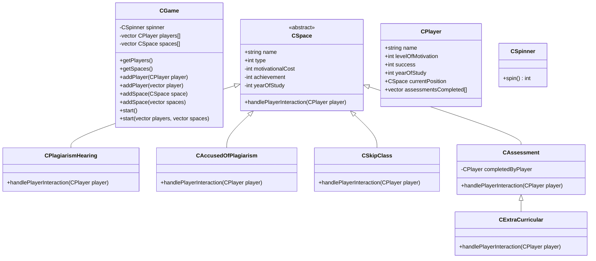

```mermaid

%% ---
%% title: Degrees of Hell (Authored by Shaheer Sarfaraz)
%% ---

classDiagram
    class CGame {
        -CSpinner spinner
        -vector CPlayer players[]
        -vector CSpace spaces[]

        %% getters
        +getPlayers()
        +getSpaces()

        %% adding players
        +addPlayer(CPlayer player)
        +addPlayer(vector<CPlayer> player)

        %% adding spaces
        +addSpace(CSpace space)
        +addSpace(vector<CSpace> spaces)

        %% start game either with existing content, or with new content
        +start()
        +start(vector<CPlayer> players, vector<CSpace> spaces)
    }

    class CSpace {
      <<abstract>>
      +string name
      +int type
      -int motivationalCost
      -int achievement
      -int yearOfStudy
      +handlePlayerInteraction(CPlayer player)
    }

    class CPlagiarismHearing {
      +handlePlayerInteraction(CPlayer player)
    }

    class CAccusedOfPlagiarism {
      +handlePlayerInteraction(CPlayer player)
    }

    class CSkipClass {
      +handlePlayerInteraction(CPlayer player)
    }

    class CAssessment {
      -CPlayer completedByPlayer
      +handlePlayerInteraction(CPlayer player)
    }

    class CExtraCurricular {
      +handlePlayerInteraction(CPlayer player)
    }

    class CPlayer {
      +string name
      +int levelOfMotivation
      +int success
      +int yearOfStudy
      +CSpace currentPosition
      +vector assessmentsCompleted[]
    }

    class CSpinner {
      +spin() int
    }

    CSpace <|-- CAssessment
    CSpace <|-- CPlagiarismHearing
    CSpace <|-- CAccusedOfPlagiarism
    CSpace <|-- CSkipClass
    CAssessment <|-- CExtraCurricular
```